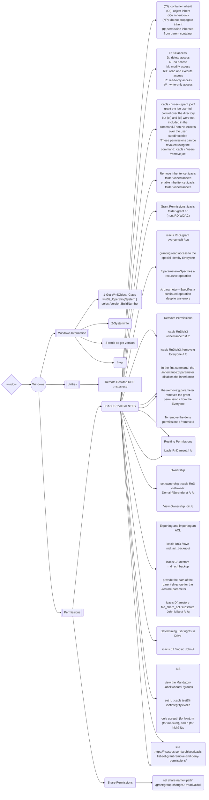

# Windows

```mermaid
  graph LR	
    
main{window}
main --> windows((Windows))

windows --> w1[[Windows Information]]
w1 --> wcommand11("1-Get-WmiObject -Class win32_OperatingSystem | select Version,BuildNumber")
w1 --> wcommand12("2-Systeminfo")
w1 --> wcommand13("3-wmic os get version")
w1 --> wcommand14("4-ver")
windows --> w2[[utilities]]
w2 --> wcommand21("Remote Desktop RDP :mstsc.exe")
windows --> w3[[Permissions]]
w3 --> wcommand31("ICACLS Tool For NTFS ")
wcommand31 --> icacls1("(CI): container inherit </br>(OI): object inherit</br>(IO): inherit only</br>(NP): do not propagate inherit</br>(I): permission inherited from parent container")
wcommand31 --> icacls2("F : full access </br>D :  delete access</br>N :  no access</br>M :  modify access</br>RX :  read and execute access</br>R :  read-only access</br>W :  write-only access")
wcommand31 --> icacls3("icacls c:\users /grant joe:f <br> grant the joe user full control over the directory<br> but (oi) and (ci) were not included in the command,Then No Access over the user subdirectories <br>*These permissions can be revoked using the command: icacls c:\users /remove joe.")
wcommand31 --> icacls4("Remove inheritence :icacls folder /inheritance:d<br>enable inheritence :icacls folder /inheritance:e")
wcommand31 --> icacls5("Grant Permissions :icacls folder /grant hr:(m,rx,RD,WDAC)")
wcommand31 --> icacls6("icacls RnD /grant everyone:R /t /c
										<br>granting read access to the special identity Everyone
										<br>/t parameter—Specifies a recursive operation
										<br>/c parameter—Specifies a continued operation despite any errors")
wcommand31 --> icacls7("ADVANCED Permissions
										<br>icacls RnD /grant:r Auditors:(WDAC) /t /c
										<br>advanced permissions need to be enclosed in parentheses
										<br>(REA) with (WDAC) write it as follows: Auditors:(WDAC,REA)")
wcommand31 --> icacls7("Interited Permissions
										<br>icacls RnD /grant:r Everyone:(OI)(CI)W /t
										<br>The /grant:r is pionting to old read ACE
										<br>we need to use both the OI and CI permissions together.")
wcommand31 --> icacls7("Remove Permissions
										<br>icacls RnD\dir3 /inheritance:d /t /c
										<br>icacls RnD\dir3 /remove:g Everyone /t /c
										<br>In the first command, the /inheritance:d parameter disables the inheritance
										<br>the /remove:g parameter removes the grant permissions from the Everyone
										<br>To remove the deny permissions : /remove:d ")
wcommand31 --> icacls8("Deny Permissions
										<br>icacls D:\FileShare\HR /deny Developers:(OI)(CI)F /t /c
										<br>deny Full Control to the Developers group on the HR directory
										<br>denying permission overrides any permission explicitly granted to the same user or group		
										<br>To remove the deny permissions : /remove:d")
wcommand31 --> icacls8("Restting Permissions
										<br>icacls RnD /reset /t /c ")
wcommand31 --> icacls9("Ownership 
										<br>set ownership :icacls RnD /setowner Domain\Surender /t /c /q
										<br>View Ownership :dir /q ")
wcommand31 --> icacls10("Exporting and importing an ACL 
										<br>icacls RnD /save rnd_acl_backup /t
										<br>icacls C:\ /restore rnd_acl_backup
										<br>provide the path of the parent directory for the /restore parameter		
										<br>icacls D:\ /restore file_share_acl /substitute John Mike /t /c /q")								
wcommand31 --> icacls11("Determining user rights In Drive 
										<br>icacls d:\ /findsid John /t")
wcommand31 --> icacls12("ILS
										<br>view the Mandatory Label:whoami /groups
										<br>set IL :icacls testDir /setintegritylevel h
										<br>only accept l (for low), m (for medium), and h (for high) ILs")
wcommand31 --> icacls13("icalcls on a folder that only gets created once a user signs
										<br>@echo OFF
										<br>set folderpath=%LOCALAPPDATA%\YourFolder
										<br>:START
										<br>if not exist %folderpath% GOTO WAIT
										<br>GOTO PERM
										<br>:WAIT
										<br>timeout /t 2 /nobreak
										<br>GOTO START
										<br>:PERM
										<br>icacls %folderpath% /grant:r 'Authenticated Users':(OI)(CI)F /t /c 
										<br>Then use the task scheduler to start the batch script <br>based on a trigger when a match is found in audit logging. Checkout this article.")
wcommand31 --> icacls13("site :https://4sysops.com/archives/icacls-list-set-grant-remove-and-deny-permissions/")

w3 --> wcommand32("Share Permissions")
wcommand32 --> share1("net share name='path' /grant:group,changeORreadORfull")

```
